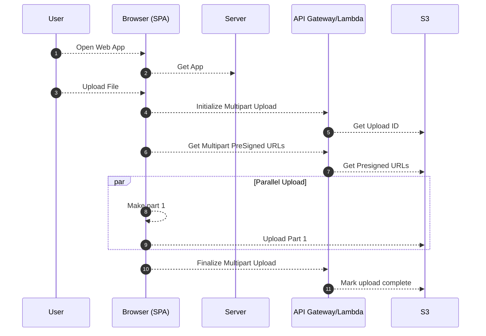

# S3M - Multipart Uploads using Laravel and AWS S3

[](https://packagist.org/packages/mreduar/s3m)
[](https://github.com/mreduar/s3m/actions?query=workflow%3Arun-tests+branch%3Amain)
[](https://github.com/mreduar/s3m/actions?query=workflow%3A"Fix+PHP+code+style+issues"+branch%3Amain)
[](https://packagist.org/packages/mreduar/s3m)

Sometimes when running an application in a serverless environment, you may not store files permanently on the local filesystem, since you can never be sure that the same serverless "container" will be used on a subsequent request. All files should be stored in a cloud storage system, such as AWS S3, or in a shared file system through AWS EFS. Or, you may want to send a file directly to Amazon S3 simply because you don't want the server to receive files directly.

When uploading large files to S3, you may run into the 5GB limit for a single PUT request. This package allows you to upload large files to S3 by splitting the file into smaller parts and uploading them in parallel.

-   [**Features**](#features)
-   [**Architecture**](#architecture)
-   [**Installation**](#installation)
-   [**Usage**](#usage)
    -   [Authorization](#authorization)
    -   [Streaming Files To S3](#streaming-files-to-s3)
    -   [Acknowledge File Uploads & Permanent Storage](#acknowledge-file-uploads--permanent-storage)
-   [**Changelog**](#changelog)
-   [**Contributing**](#contributing)
-   [**Security Vulnerabilities**](#security-vulnerabilities)
-   [**Credits**](#credits)
-   [**License**](#license)

## Features

-   Upload large files that exceed the 5GB limit
-   Upload files in parallel
-   Configurable Chunked uploads
-   Configurable number of parallel uploads

## Architecture



## Installation

You can install the package via composer:

```bash
composer require mreduar/s3m
```

Add the `@s3m` Blade directive to your main layout (_before_ your application's JavaScript), and the `s3m()` helper function will be available globally!

## Usage

### Authorization

Before initiating an upload directly to S3, S3M's internal signed storage URL generator will perform an authorization check against the currently authenticated user. If you do not already have one, you should create a UserPolicy for your application using the following command:

```bash
php artisan make:policy UserPolicy --model=User
```

Next, you should add an `uploadFiles` method to this policy. This method should return `true` if the given authenticated user is allowed to upload files. Otherwise, you should return `false`:

```php
/**
 * Determine whether the user can upload files.
 *
 * @param  \App\User  $user
 * @return mixed
 */
public function uploadFiles(User $user)
{
    return true;
}
```

### Streaming Files To S3

You may use the `s3m()` method within your frontend code to upload a file directly to the S3 bucket attached to your environment. The following example demonstrates this functionality using Vue:

```js
<input type="file" id="file" ref="file" @change="uploadFile">

const uploadFile = (e) => {
    const file = e.target.files[0];

    s3m(file, {
        progress: progress => {
            this.uploadProgress = Math.round(progress * 100);
        }
    }).then((response) => {
        axios.post('/api/profile-photo', {
            uuid: response.uuid,
            key: response.key,
            bucket: response.bucket,
            name: file.value.name,
            content_type: file.value.type,
        })
    });
};
```

All uploaded files will be placed in a `tmp` directory within the bucket. This directory should be configured to automatically purge any files older than 24 hours. This feature serves to conveniently clean up file uploads that are initiated but not completed, such as a user that begins updating their profile photo but does not save the change.

The `tmp` directory is private by default. To override this for a given file you may add a `visibility` property to the options provided to the `s3m()` method. The `visibility` property should be assigned one of [S3's predefined permission grants](https://docs.aws.amazon.com/AmazonS3/latest/dev/acl-overview.html#canned-acl):

```js
s3m(file, {
    visibility: 'public-read',
}).then((response) => {
    // ...
});
```

### Acknowledge File Uploads & Permanent Storage

All uploaded files will be stored using a UUID as their filename. The `response` provided to the `s3m` method's `then` callback will contain the UUID of the file, the file's full S3 key, and the file's bucket. You may then POST this information to your application's backend to permanently store the file by moving it out of the bucket's `tmp` directory. In addition, you may wish to store additional information about the file, such as its original name and content type, in your application's database:

```php
use Illuminate\Support\Facades\Storage;

Storage::copy(
    $request->input('key'),
    str_replace('tmp/', '', $request->input('key'))
);
```

## Changelog

Please see [CHANGELOG](CHANGELOG.md) for more information on what has changed recently.

## Contributing

Please see [CONTRIBUTING](CONTRIBUTING.md) for details.

## Security Vulnerabilities

Please review [our security policy](../../security/policy) on how to report security vulnerabilities.

## Credits

-   [Eduar Bastidas](https://github.com/mreduar)
-   [All Contributors](../../contributors)

This project is inspired by [Laravel Vapor](https://vapor.laravel.com/). The architecture and design of this package is influenced by the work of the Laravel team and other resources.

## License

The MIT License (MIT). Please see [License File](LICENSE.md) for more information.
